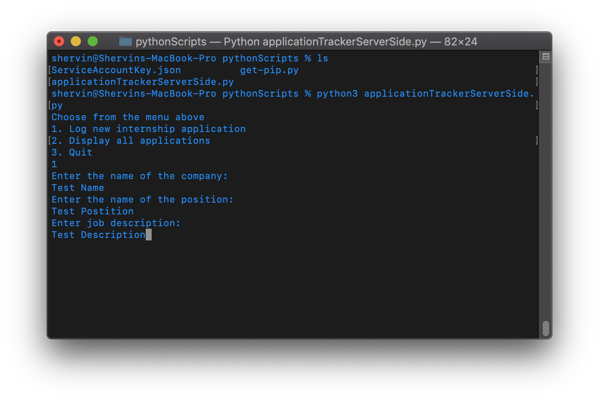

# ApplicationTracker
<h2>Android Application<h2>

Creating an android application to keep track of job and internship applications.
Android application is mainly going to be used as the client side to view the job applications that I have currently applied to. The Application Tracker server side is a python script that is run in the terminal, to reduce start up time when using a GUI, which will be the main way of adding new applications to the database.

<h2>Python Script<h2>

